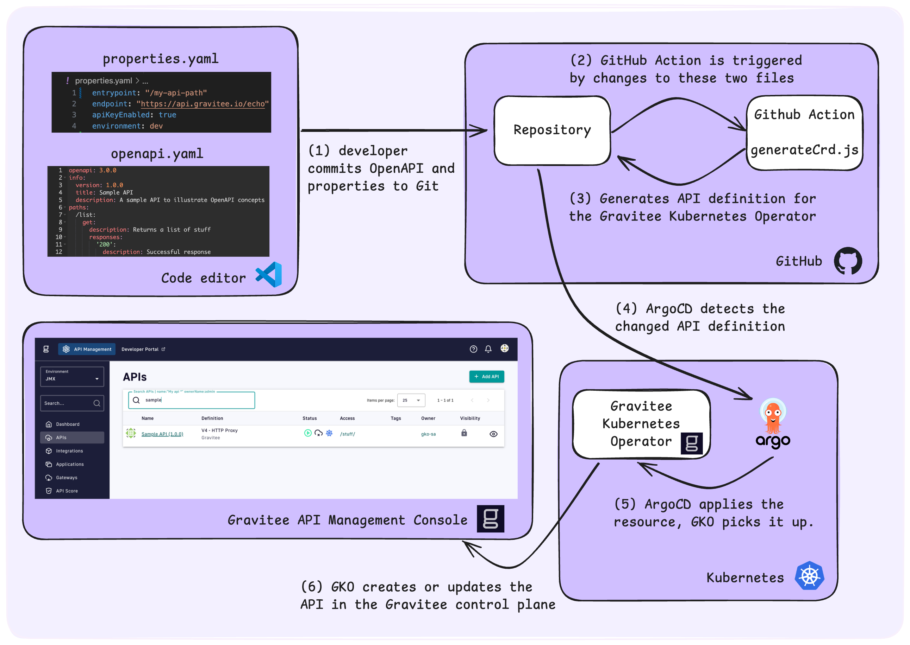

# APIOps with Gravitee.io - from OpenAPI to Gravitee


APIOps is about applying Infrastructure-as-Code (IaC) and GitOps to the management of APIs. Teams that want increased levels of automation, reliability, and scalability in the way they manage APIs are investing in APIOps. Gravitee is committed to supporting companies on their journey towards APIOps. 

This repo provides an example APIOps pipeline that implements the architecture shown in the diagram below.



Fork the repo and have a go yourself! More detailed instructions and other improvements coming soon.

## Getting started

```sh
kubectl create namespace argocd
kubectl apply -n argocd -f https://raw.githubusercontent.com/argoproj/argo-cd/stable/manifests/install.yaml
argocd login --core
brew install argocd
kubectl config set-context --current --namespace=argocd
```

```sh
argocd app create apiops --repo https://github.com/jmcx/apiops-oas-tutorial.git  --path "." --dest-namespace default --dest-server https://kubernetes.default.svc
```

```sh
argocd app sync apiops
```